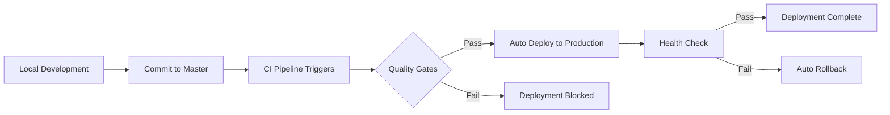

# Direct Master Deployment Strategy

**Version**: 1.0
**Updated**: 2025-09-23
**Status**: Active

## Overview

This project uses a **direct master deployment strategy** for simplified, streamlined development and release workflows. All changes are committed directly to the master branch and automatically deployed to production.

## 🚀 Deployment Workflow



## 📋 Quality Gates

Every commit to master must pass these automated quality gates:

### 🎨 Code Quality
- **Formatting**: `ruff format --check`
- **Linting**: `ruff check` with zero errors
- **Import Sorting**: `isort --check-only`
- **Type Checking**: `mypy` (warnings allowed)

### 🧪 Testing
- **Unit Tests**: 100% pass rate required
- **Integration Tests**: All critical paths covered
- **Coverage**: Minimum 80% code coverage
- **Performance Tests**: Response time benchmarks met

### 🛡️ Security
- **Static Analysis**: `bandit` security scan
- **Dependency Check**: `safety` vulnerability scan
- **Secret Detection**: No hardcoded secrets
- **Container Security**: Docker image scan

### 📦 Build Validation
- **Docker Build**: Successful production image build
- **Package Install**: Clean `pip install` from source
- **Health Check**: Application starts and responds

## 🔄 Deployment Process

### Automatic Deployment (Recommended)
Every push to master triggers automatic deployment:

```bash
# 1. Make your changes locally
git add .
git commit -m "feat: add new validation feature"

# 2. Push to master (triggers CI/CD)
git push origin master

# 3. Monitor deployment in GitHub Actions
# 4. Verify deployment success at production URL
```

### Manual Deployment (Optional)
For special cases, use the deployment script:

```bash
# Deploy to production
./scripts/deploy.sh production

# Deploy to staging
./scripts/deploy.sh staging

# Deploy to development
./scripts/deploy.sh development
```

## 📊 Monitoring & Rollbacks

### Real-time Monitoring
- **GitHub Actions**: Monitor pipeline status
- **Application Logs**: Kubernetes/Docker logs
- **Health Endpoints**: `/health` and `/health/detailed`
- **Metrics**: Prometheus metrics collection

### Rollback Procedures

#### Automatic Rollback
- Failed health checks trigger automatic rollback
- Previous working version restored within 2 minutes

#### Manual Rollback
```bash
# Kubernetes rollback
kubectl rollout undo deployment/migration-validator-app -n migration-validator-prod

# Docker Compose rollback
docker-compose down
git revert <commit-hash>
docker-compose up -d
```

## 🔧 Development Guidelines

### Pre-commit Checklist
Before committing to master, ensure:

- [ ] Code is formatted (`ruff format src/ tests/`)
- [ ] Linting passes (`ruff check src/ tests/`)
- [ ] Tests pass locally (`python run_tests.py --unit`)
- [ ] No security issues (`bandit -r src/`)
- [ ] Documentation updated if needed
- [ ] Commit message follows convention

### Commit Message Convention
```
type(scope): description

feat(auth): add JWT token validation
fix(api): resolve memory leak in analyzer
docs(deploy): update deployment guide
refactor(core): simplify validation logic
test(unit): add tests for new features
```

### Emergency Procedures

#### Hotfix Process
For critical production issues:

1. **Identify Issue**: Monitor alerts, logs, user reports
2. **Create Fix**: Develop minimal fix locally
3. **Test Fix**: Run full test suite locally
4. **Deploy Fix**: Commit directly to master
5. **Verify Fix**: Monitor production health
6. **Document**: Update incident log

#### Breaking Changes
For changes that may break existing functionality:

1. **Feature Flags**: Use environment variables to control new features
2. **Backward Compatibility**: Maintain API compatibility when possible
3. **Migration Scripts**: Provide database/config migration tools
4. **Communication**: Document breaking changes in commit messages

## 📈 Advantages of Direct Master Deployment

### ✅ Benefits
- **Simplified Workflow**: No complex branching strategies
- **Faster Deployment**: Immediate production deployment
- **Reduced Conflicts**: No merge conflicts between branches
- **Clear History**: Linear commit history
- **Faster Fixes**: Quick hotfixes without PR overhead
- **Automated Dependencies**: Dependabot updates deploy immediately

### ⚠️ Considerations
- **Higher Risk**: Direct production deployment
- **Team Coordination**: Requires good communication
- **Quality Discipline**: Must maintain high code quality
- **Monitoring**: Requires robust monitoring and alerting

## 🛠️ Tools & Configuration

### CI/CD Pipeline
- **GitHub Actions**: `.github/workflows/ci.yml`
- **Quality Gates**: Automated testing and validation
- **Deployment**: Direct to production on master push
- **Notifications**: Slack/email alerts on failure

### Dependencies Management
- **Dependabot**: Auto-updates target master branch
- **Security Updates**: Automatic security patch deployment
- **Grouped Updates**: Related dependencies updated together

### Monitoring Stack
- **Application**: Health checks, metrics endpoints
- **Infrastructure**: Kubernetes/Docker monitoring
- **Logs**: Centralized logging with ELK stack
- **Alerts**: PagerDuty/Slack integration

## 📚 Related Documentation

- [Deployment Guide](deployment-guide.md) - Detailed deployment instructions
- [Operations Manual](operations-manual.md) - Day-to-day operations
- [Troubleshooting Guide](troubleshooting.md) - Common issues and solutions
- [Security Guidelines](security-guidelines.md) - Security best practices

## 🎯 Success Metrics

### Deployment Performance
- **Deployment Frequency**: Multiple deployments per day
- **Lead Time**: < 10 minutes from commit to production
- **Recovery Time**: < 5 minutes for rollbacks
- **Success Rate**: > 95% deployment success rate

### Quality Metrics
- **Test Coverage**: > 80% code coverage maintained
- **Bug Escape Rate**: < 2% bugs reach production
- **Security Issues**: Zero high-severity vulnerabilities
- **Performance**: 99.9% uptime maintained

---

**Last Updated**: 2025-09-23
**Next Review**: 2025-10-23
**Owner**: DevOps Team