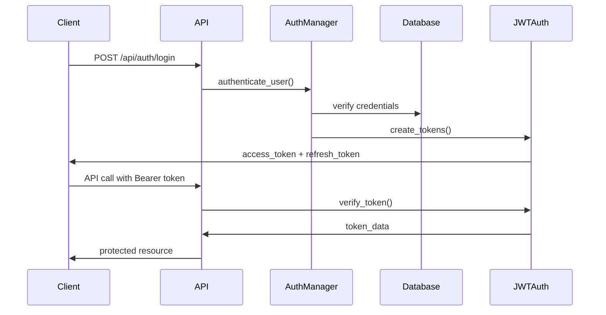
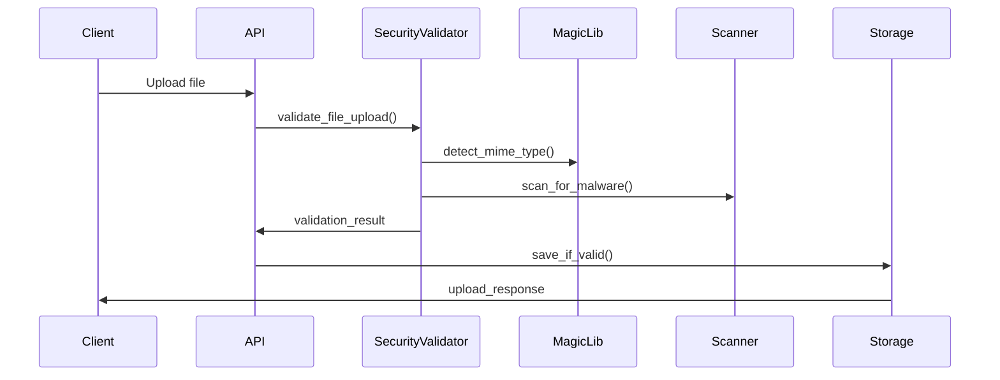

# Security Architecture and Implementation Guide

## Overview

This document provides a comprehensive overview of the security architecture implemented in the AI-Powered Migration Validation System. The system implements defense-in-depth security measures following OWASP guidelines and industry best practices.

## Security Architecture

### 1. Authentication & Authorization

#### JWT-Based Authentication
- **Algorithm**: HS256 (HMAC with SHA-256)
- **Token Types**: Access tokens (30 min), Refresh tokens (30 days)
- **Token Revocation**: JTI (JWT ID) blacklisting
- **Claims Validation**: Comprehensive token validation with expiry checks

#### Role-Based Access Control (RBAC)
- **Admin**: Full system access, user management
- **Validator**: Can perform validations, upload files
- **Viewer**: Read-only access to results
- **API Client**: Programmatic access for integrations

#### Account Security
- **Password Policy**: Minimum 8 characters, complexity requirements
- **Account Lockout**: 5 failed attempts = 15-minute lockout
- **Session Management**: Secure session handling with timeout
- **Multi-Factor Authentication**: Ready for MFA integration

### 2. Input Validation & Sanitization

#### Comprehensive Input Validation
```python
# Security validation includes:
- SQL injection prevention
- XSS attack prevention
- Path traversal protection
- Command injection prevention
- File type validation
- Size limit enforcement
```

#### File Upload Security
- **MIME Type Detection**: Using python-magic for accurate detection
- **Malware Scanning**: Integration ready for ClamAV/VirusTotal
- **Size Limits**: 10MB per file, 100MB total
- **Extension Validation**: Whitelist-based approach
- **Content Scanning**: Pattern detection for malicious content

### 3. Rate Limiting & DDoS Protection

#### Multi-Algorithm Rate Limiting
- **Sliding Window**: Default algorithm for smooth rate limiting
- **Token Bucket**: For burst handling with configurable multipliers
- **Fixed Window**: For strict time-based limits

#### Rate Limit Categories
```yaml
Authentication: 5 requests/minute
File Upload: 10 requests/5 minutes
Validation: 20 requests/hour
General API: 100 requests/minute
```

#### Protection Levels
- **Per-User**: Authenticated user limits
- **Per-IP**: Anonymous user protection
- **Global**: System-wide protection

### 4. Security Headers & Middleware

#### HTTP Security Headers
```http
X-Content-Type-Options: nosniff
X-Frame-Options: DENY
X-XSS-Protection: 1; mode=block
Content-Security-Policy: strict CSP
Strict-Transport-Security: max-age=31536000
Referrer-Policy: strict-origin-when-cross-origin
Permissions-Policy: restrictive permissions
```

#### Security Middleware Features
- **Request Size Limiting**: 10MB maximum request size
- **IP Blocking**: Configurable IP blacklisting
- **User Agent Filtering**: Block suspicious user agents
- **Request Tracking**: Unique request ID tracking
- **Security Event Logging**: Comprehensive security logging

### 5. Encryption & Data Protection

#### Data at Rest
- **Symmetric Encryption**: AES-256-GCM using Fernet
- **Key Management**: PBKDF2-based key derivation
- **Context-Based Keys**: Different keys for different data types
- **Key Rotation**: Automated key rotation support

#### Data in Transit
- **HTTPS Enforcement**: TLS 1.2+ required in production
- **Certificate Validation**: Proper SSL/TLS configuration
- **HSTS**: HTTP Strict Transport Security enabled

#### Sensitive Data Handling
- **API Key Storage**: Encrypted storage for LLM provider keys
- **Password Hashing**: bcrypt with salt
- **Token Security**: Secure token generation and storage

### 6. CORS & Cross-Origin Security

#### Development vs Production
```python
# Development: Permissive for local development
CORS_ORIGINS = ["*"]

# Production: Strict origin control
CORS_ORIGINS = [
    "https://migration-validator.com",
    "https://api.migration-validator.com"
]
```

#### CORS Configuration
- **Credentials**: Controlled credential sharing
- **Methods**: Limited to necessary HTTP methods
- **Headers**: Whitelist approach for allowed headers
- **Preflight**: Proper OPTIONS handling

## Implementation Details

### 1. Security Configuration

The system uses a layered security configuration approach:

```python
# Security levels: LOW, MEDIUM, HIGH, CRITICAL
# Environment-based: development, staging, production
# Policy-driven: different policies per security level
```

### 2. Authentication Flow



### 3. File Upload Security Flow



## Security Testing

### 1. Automated Security Tests

```bash
# Run security test suite
pytest tests/security/ -v

# Static security analysis
bandit -r src/ -f json -o security-report.json

# Dependency vulnerability scanning
safety check --json
```

### 2. Test Categories

- **Authentication Tests**: Token validation, user management
- **Authorization Tests**: RBAC enforcement, privilege escalation
- **Input Validation Tests**: Injection attacks, malformed input
- **Rate Limiting Tests**: Burst protection, sustained attacks
- **File Security Tests**: Malicious file uploads, MIME spoofing

### 3. Security Benchmarks

```python
# Performance benchmarks for security features
- Token validation: <10ms
- File scanning: <100ms per MB
- Rate limit check: <5ms
- Input validation: <50ms
```

## Deployment Security

### 1. Environment Variables

```bash
# Required security environment variables
JWT_SECRET_KEY=<32+ character secure key>
MASTER_ENCRYPTION_KEY=<base64 encoded 32-byte key>
CORS_ORIGINS=["https://yourdomain.com"]
SECURITY_LEVEL=HIGH
```

### 2. Production Checklist

- [ ] JWT secret key changed from default
- [ ] CORS origins configured for production domains
- [ ] HTTPS enforced with valid certificates
- [ ] Security headers enabled
- [ ] Rate limiting configured
- [ ] File upload limits set
- [ ] Logging configured for security events
- [ ] Backup encryption keys stored securely

### 3. Monitoring & Alerting

```python
# Security events to monitor:
- Failed authentication attempts
- Rate limit violations
- Suspicious file uploads
- Privilege escalation attempts
- Token tampering
- Unusual access patterns
```

## Compliance & Standards

### 1. OWASP Compliance

The system addresses all OWASP Top 10 vulnerabilities:

1. **Injection**: Input validation and parameterized queries
2. **Broken Authentication**: Strong authentication mechanisms
3. **Sensitive Data Exposure**: Encryption and secure transmission
4. **XML External Entities**: Input validation and safe parsing
5. **Broken Access Control**: RBAC and authorization checks
6. **Security Misconfiguration**: Secure defaults and hardening
7. **Cross-Site Scripting**: Input sanitization and CSP
8. **Insecure Deserialization**: Safe deserialization practices
9. **Known Vulnerabilities**: Dependency scanning and updates
10. **Insufficient Logging**: Comprehensive security logging

### 2. Data Protection

- **GDPR Compliance**: Data minimization and user rights
- **Data Retention**: Configurable retention policies
- **Anonymization**: User data anonymization capabilities
- **Audit Trails**: Comprehensive audit logging

## Security Updates & Maintenance

### 1. Regular Updates

```bash
# Monthly security updates
pip-audit --desc
safety check --json
bandit -r src/

# Dependency updates
pip-compile requirements-security.in
```

### 2. Key Rotation

```python
# Automated key rotation (90-day cycle)
- JWT signing keys
- Encryption keys
- API keys
- TLS certificates
```

### 3. Security Monitoring

- **Log Analysis**: Automated security event analysis
- **Anomaly Detection**: Unusual access pattern detection
- **Threat Intelligence**: Integration with security feeds
- **Incident Response**: Automated response procedures

## Contact & Support

For security-related issues:

- **Security Email**: security@migration-validator.com
- **Vulnerability Reporting**: Use responsible disclosure
- **Security Documentation**: Keep this document updated
- **Emergency Contact**: 24/7 security hotline for critical issues

## Appendix

### A. Security Headers Reference

See [headers.py](../src/security/headers.py) for complete implementation.

### B. Rate Limiting Configuration

See [rate_limiter.py](../src/security/rate_limiter.py) for algorithms and configuration.

### C. Authentication API Reference

See [auth_routes.py](../src/api/auth_routes.py) for authentication endpoints.

### D. Security Testing

See [tests/security/](../tests/security/) for comprehensive security tests.

---

**Last Updated**: [Current Date]
**Version**: 1.0.0
**Reviewed By**: Security Team