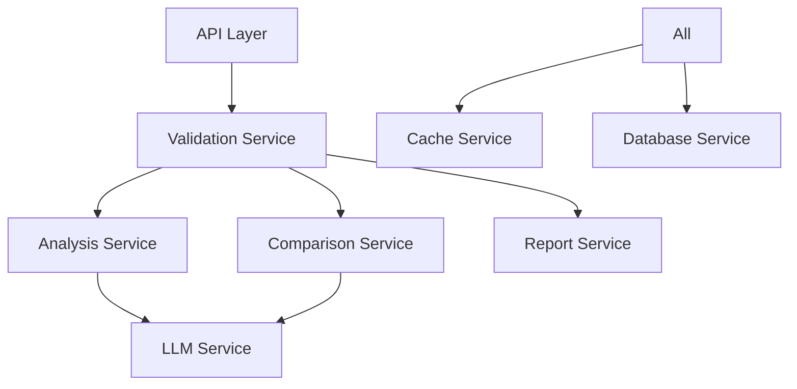

# AI-Powered Migration Validation System - Architecture Analysis

**Analysis Date**: 2025-09-19
**Analyst**: Claude Code System Architect
**System Version**: 1.0.0 (Current Implementation)

## Executive Summary

The AI-Powered Migration Validation System has achieved significant implementation progress with a well-structured 3-stage pipeline architecture. The core components are implemented and functional, representing approximately **70% completion** of the MVP functionality. However, critical production-readiness components remain incomplete.

**Current Status:**
- ✅ **Core Architecture**: Solid foundation with clear separation of concerns
- ✅ **Data Models**: Comprehensive and well-designed
- ✅ **Analysis Pipeline**: 3-stage validation pipeline implemented
- ✅ **REST API**: Functional FastAPI implementation
- ⚠️ **Configuration Management**: Missing
- ❌ **LLM Integration**: Placeholder only
- ❌ **Security Layer**: Not implemented
- ❌ **Testing**: No test coverage
- ❌ **Deployment**: No containerization or infrastructure

## Architectural Strengths

### 1. **Clean Separation of Concerns**
```
src/
├── core/           # Business logic & orchestration
├── analyzers/      # Feature extraction engines
├── comparators/    # Semantic comparison logic
├── reporters/      # Report generation
└── api/           # REST interface
```

**Benefits:**
- Modular design enables independent development
- Clear data flow through pipeline stages
- Extensible analyzer architecture supports new technologies

### 2. **Robust Data Model Design**
The `models.py` implementation demonstrates thoughtful design:
- Comprehensive enums for type safety (`TechnologyType`, `ValidationScope`, `SeverityLevel`)
- Rich dataclasses with proper typing and validation
- Session-based processing with logging capabilities
- Flexible input handling (code files, screenshots, hybrid)

### 3. **Scalable Validation Pipeline**
The 3-stage architecture aligns perfectly with the original proposal:
1. **Analysis**: Separate analyzers for code and visual input
2. **Comparison**: Semantic matching with scope-based weighting
3. **Reporting**: Multi-format output (JSON, HTML, Markdown)

### 4. **Technology Agnostic Foundation**
Support for multiple technology stacks:
- Frontend: React, Vue, Angular (JS/TS)
- Backend: Python (Flask/Django), Java (Spring), C# (.NET), PHP (Laravel)
- Extensible enum-based technology registration

## Critical Gaps & Risks

### 🔴 **Critical - LLM Integration Missing**
**Risk**: Core AI functionality is placeholder code
**Impact**: System cannot perform semantic analysis
**Current State**: Mock responses only

```python
# Current placeholder in semantic_comparator.py
async def _call_llm_for_comparison(self, prompt: str, data: Dict[str, Any]) -> str:
    return await self._mock_llm_comparison_response(data)
```

### 🔴 **Critical - No Security Implementation**
**Risk**: Production deployment vulnerability
**Impact**: File upload exploits, injection attacks
**Missing Components**:
- Input sanitization
- File type validation beyond extensions
- Rate limiting
- Authentication/authorization
- CORS configuration hardening

### 🔴 **Critical - Configuration Management**
**Risk**: Hardcoded values, no environment flexibility
**Impact**: Cannot deploy across environments
**Missing**: Database config, LLM API keys, file size limits, security settings

### 🟡 **High - No Test Coverage**
**Risk**: Regression issues during development
**Impact**: Quality assurance gaps
**Missing**: Unit tests, integration tests, API tests

### 🟡 **High - Error Handling Gaps**
**Risk**: Poor user experience on failures
**Current Issues**:
- Generic exception handling
- Limited retry mechanisms
- No circuit breaker patterns for LLM calls

## Implementation Quality Assessment

### **Code Quality: B+**
- Clean, readable code with good documentation
- Proper use of type hints and dataclasses
- Consistent naming conventions
- Good separation of concerns

### **Architecture Quality: A-**
- Well-designed pipeline architecture
- Extensible analyzer pattern
- Proper async/await usage
- Clear data flow

### **Production Readiness: D**
- No configuration management
- Missing security layers
- No monitoring/observability
- No deployment infrastructure

## Technology Integration Analysis

### **Current Technology Support Matrix**

| Technology | Analysis Support | Comparison Quality | Production Ready |
|------------|------------------|-------------------|------------------|
| Python | ✅ AST parsing | ✅ High | ⚠️ Needs LLM |
| JavaScript/React | ✅ Regex patterns | ✅ Medium | ⚠️ Needs LLM |
| Java | ❌ Placeholder | ❌ None | ❌ Not implemented |
| C# | ❌ Placeholder | ❌ None | ❌ Not implemented |
| PHP | ❌ Placeholder | ❌ None | ❌ Not implemented |
| HTML | ✅ Regex patterns | ✅ Medium | ✅ Functional |

### **LLM Integration Requirements**

**Missing Infrastructure:**
- LLM provider abstraction layer
- API key management and rotation
- Rate limiting and quota management
- Fallback strategies for API failures
- Cost optimization (prompt caching, model selection)

**Recommended Providers:**
- **Primary**: OpenAI GPT-4 (code understanding)
- **Secondary**: Anthropic Claude (safety, analysis)
- **Backup**: Google Gemini (multimodal capabilities)

## Scalability Considerations

### **Current Limitations**
1. **Memory-based session storage** → Won't scale beyond single instance
2. **Synchronous file processing** → Limited throughput
3. **No request queuing** → High load failures
4. **No caching mechanism** → Repeated analysis overhead

### **Scaling Recommendations**
1. **Database Integration**: PostgreSQL for session persistence
2. **Message Queue**: Redis/RabbitMQ for async processing
3. **Caching Layer**: Redis for repeated analysis results
4. **Load Balancing**: Multiple API instances with shared storage

## Security Architecture Gap Analysis

### **Input Validation Gaps**
```python
# Current basic validation
if ext not in self.allowed_code_extensions:
    raise ValueError(f"Unsupported extension: {ext}")

# Missing: Content scanning, size limits, magic byte validation
```

### **File Handling Risks**
- **Path Traversal**: Basic prevention exists but insufficient
- **Malicious Content**: No content scanning
- **Resource Exhaustion**: Limited size checks only

### **API Security Missing**
- Authentication/authorization
- Request rate limiting
- Input sanitization
- CORS policy enforcement
- Security headers

## Performance Analysis

### **Current Performance Characteristics**
- **File Processing**: Linear, blocking
- **Memory Usage**: High for large files (no streaming)
- **Concurrency**: Limited by async implementation
- **Caching**: None implemented

### **Bottleneck Identification**
1. **LLM API Calls**: Will be primary bottleneck
2. **File I/O**: Synchronous read operations
3. **AST Parsing**: CPU intensive for large codebases
4. **Memory Usage**: Full file content loading

## Recommended Architecture Enhancements

### **Service Layer Pattern**
```python
# Proposed structure
src/
├── services/       # Business logic services
│   ├── llm_service.py
│   ├── cache_service.py
│   └── security_service.py
├── config/         # Configuration management
├── middleware/     # Security, logging, rate limiting
└── infrastructure/ # Database, queue, monitoring
```

### **Design Patterns to Implement**
1. **Repository Pattern**: Database abstraction
2. **Factory Pattern**: Analyzer instantiation
3. **Strategy Pattern**: LLM provider switching
4. **Circuit Breaker**: LLM failure handling
5. **Observer Pattern**: Progress tracking

## Integration Points & Dependencies

### **External Dependencies Required**
- **LLM APIs**: OpenAI, Anthropic, Google
- **Database**: PostgreSQL (primary), Redis (cache)
- **Message Queue**: Redis/RabbitMQ
- **File Storage**: Local filesystem or S3
- **Monitoring**: Prometheus, Grafana
- **Logging**: Structured logging (JSON)

### **Internal Service Communications**


## Conclusion & Next Steps

The AI-Powered Migration Validation System demonstrates excellent architectural foundation with **strong core implementation**. The modular design and comprehensive data models provide a solid base for production deployment.

**Critical Path to MVP:**
1. **LLM Integration** (2-3 weeks)
2. **Configuration Management** (1 week)
3. **Security Implementation** (2 weeks)
4. **Testing Suite** (2 weeks)
5. **Deployment Pipeline** (1 week)

**Estimated Time to Production**: 6-8 weeks with focused development effort.

The system's architecture quality positions it well for long-term maintainability and feature expansion. The identified gaps are addressable through systematic implementation of missing components rather than architectural redesign.