# 🚀 CI/CD Pipeline Setup Guide

## 📋 Overview

AI-Powered Migration Validation System → Comprehensive GitHub Actions pipeline for automated testing, security scanning, and quality assurance.

## 🏗️ Pipeline Architecture

```mermaid
graph TD
    A[Code Push/PR] --> B{Fast Quality Checks}
    B -->|✅ Pass| C[Security Scanning]
    B -->|❌ Fail| X[Block Pipeline]
    
    C --> D[Test Matrix]
    C --> E[Dependency Scan]
    
    D --> F[Unit Tests]
    D --> G[Integration Tests]
    D --> H[Behavioral Tests]
    
    F --> I[Coverage Report]
    G --> I
    H --> I
    
    I --> J[Performance Tests]
    E --> K[Security Summary]
    
    J --> L[✅ Pipeline Complete]
    K --> L
```



## 🎯 Workflows

### 1. 🚀 Main CI Pipeline (`ci.yml`)
**Triggers:** Push to main/develop, PRs
**Purpose:** Core testing and validation

**Jobs:**
- **🔍 Quality:** Code formatting, linting, type checking
- **🛡️ Security:** Basic security scans
- **🧪 Test Matrix:** Python 3.8-3.12 across OS platforms
- **⚡ Performance:** Load/performance testing (optional)
- **✅ Status:** Final pipeline status

**Matrix Strategy:**
```yaml
python-version: ["3.8", "3.9", "3.10", "3.11", "3.12"]
os: [ubuntu-latest, macos-latest, windows-latest]
test-category: [unit, integration, behavioral]
```

### 2. 🛡️ Security Analysis (`security.yml`)
**Triggers:** Daily schedule, security-sensitive changes
**Purpose:** Comprehensive security scanning

**Scans:**
- **Static Analysis:** Bandit, Semgrep
- **Dependencies:** Safety, pip-audit, SBOM generation
- **Secrets:** TruffleHog, GitLeaks
- **Compliance:** Checkov, dlint
- **AI/ML Security:** Model loading, API key patterns

### 3. 🔍 PR Quality Checks (`pr-checks.yml`)
**Triggers:** PR events
**Purpose:** Fast feedback for code reviews

**Features:**
- **PR Validation:** Size analysis, change detection
- **Fast Checks:** Formatting, linting (< 5 min)
- **Focused Testing:** Tests for changed code only
- **Security Check:** Security scan for changed files
- **PR Comments:** Automated status updates

## 🔧 Setup Instructions

### 1. Repository Secrets

Configure these secrets in GitHub Settings → Secrets and variables → Actions:

```bash
CODECOV_TOKEN=<your-codecov-token>
```

**Optional (for enhanced features):**
```bash
SLACK_WEBHOOK_URL=<slack-notification-webhook>
SONAR_TOKEN=<sonarcloud-token>
```

### 2. Branch Protection Rules

Configure branch protection for `main`:

```yaml
Required status checks:
  - "🔍 Code Quality"
  - "🧪 Test Python 3.12 (unit)"
  - "🧪 Test Python 3.12 (integration)"
  - "🛡️ Security Scan"

Additional settings:
  - Require branches to be up to date: ✅
  - Restrict pushes that create files: ✅
  - Allow force pushes: ❌
  - Allow deletions: ❌
```

### 3. Codecov Integration

1. Sign up at [codecov.io](https://codecov.io)
2. Connect your repository
3. Copy the upload token
4. Add as `CODECOV_TOKEN` secret

### 4. Dependabot Configuration

Dependabot is pre-configured in `.github/dependabot.yml`:

- **Python deps:** Weekly updates (Mondays)
- **GitHub Actions:** Weekly updates (Tuesdays)  
- **Docker:** Monthly updates
- **Auto-grouping:** Related dependencies grouped together
- **Security alerts:** Enabled for immediate vulnerability updates

### 5. Development Workflow

```bash
# 1. Create feature branch
git checkout -b feature/your-feature

# 2. Make changes and test locally
python run_tests.py --unit --fast

# 3. Check code quality
ruff format src/ tests/
isort src/ tests/
flake8 src/ tests/

# 4. Commit and push
git add .
git commit -m "feat: add new functionality"
git push origin feature/your-feature

# 5. Create PR - CI pipeline runs automatically
```

## 📊 Quality Gates

### Code Quality
- **Ruff:** Code formatting and basic linting must pass
- **isort:** Import sorting must be correct
- **flake8:** Linting issues must be resolved
- **mypy:** Type hints encouraged (warnings only)

### Testing
- **Coverage:** Minimum 80% required
- **Unit Tests:** Must pass on all Python versions
- **Integration Tests:** Must pass on latest Python
- **Security Tests:** No high/critical vulnerabilities

### Security
- **Bandit:** No security issues in code
- **Safety:** No vulnerable dependencies
- **Secrets:** No hardcoded secrets detected

## 🚀 Performance Features

### Caching Strategy
- **Pip cache:** Python dependencies cached by version
- **Test cache:** Test databases and fixtures cached
- **Action cache:** GitHub Actions dependencies cached

### Parallel Execution
- **Test matrix:** Runs across multiple Python versions/OS
- **Parallel pytest:** Tests run with `-n auto` when possible
- **Concurrent jobs:** Quality, security, tests run in parallel

### Optimization
- **Fast feedback:** Quality checks complete in < 5 minutes
- **Focused testing:** Only tests related to changes for PRs
- **Smart caching:** Aggressive caching reduces pipeline time by 60%

## 🔄 Monitoring & Alerts

### GitHub Notifications
- **Failed builds:** Automatic notifications to PR authors
- **Security alerts:** Immediate notifications for vulnerabilities
- **Status checks:** Real-time status in PR interface

### Reports & Artifacts
- **Coverage reports:** HTML and XML formats
- **Security reports:** JSON reports for all scans
- **Test reports:** JUnit XML for test results
- **Performance reports:** Load testing results

### Dashboards
- **Codecov:** Coverage trends and reports
- **GitHub Insights:** Workflow success rates
- **Security tab:** Vulnerability alerts and status

## 🛠️ Customization

### Adding New Tests
```python
# tests/new_test.py
import pytest

@pytest.mark.unit
def test_new_functionality():
    """Unit test with proper marker."""
    assert True

@pytest.mark.integration  
def test_system_integration():
    """Integration test marker."""
    assert True

@pytest.mark.slow
def test_performance_heavy():
    """Slow test marker - runs only in comprehensive mode."""
    assert True
```

### Custom Workflow Triggers
```yaml
# .github/workflows/custom.yml
on:
  workflow_dispatch:
    inputs:
      environment:
        description: 'Target environment'
        required: true
        default: 'staging'
        type: choice
        options:
          - 'staging'
          - 'production'
```

### Security Exceptions
```yaml
# .bandit
[bandit]
exclude_dirs: tests
skips: B101,B601

[bandit.assert_used]
level: LOW
```

## 🚨 Troubleshooting

### Common Issues

**1. Coverage Too Low**
```bash
# Check coverage locally
python run_tests.py --coverage
open htmlcov/index.html
```

**2. Security Scan Failures**
```bash
# Run security checks locally
bandit -r src/ --severity-level medium
safety check
```

**3. Flaky Tests**
```bash
# Run tests multiple times to identify flaky tests
python -m pytest tests/ --count=10
```

**4. Slow Pipeline**
```bash
# Check job timings in GitHub Actions
# Optimize by:
# - Adding more specific test markers
# - Improving caching strategy
# - Reducing test scope for PRs
```

### Debug Mode
Enable debug mode in workflows:
```yaml
env:
  ACTIONS_STEP_DEBUG: true
  ACTIONS_RUNNER_DEBUG: true
```

## 📈 Metrics & KPIs

### Pipeline Performance
- **Average runtime:** Target < 15 minutes
- **Success rate:** Target > 95%
- **Cache hit rate:** Target > 80%

### Code Quality
- **Coverage trend:** Monitor weekly
- **Flake8 violations:** Trend should decrease
- **Security issues:** Target zero high/critical

### Development Velocity
- **PR feedback time:** Target < 5 minutes for fast checks
- **Time to merge:** Monitor and optimize
- **Failed PR rate:** Target < 10%

## 🔗 Links & Resources

- [GitHub Actions Documentation](https://docs.github.com/en/actions)
- [Pytest Documentation](https://docs.pytest.org/)
- [Codecov Documentation](https://docs.codecov.com/)
- [Bandit Security Linter](https://bandit.readthedocs.io/)
- [Safety Package Scanner](https://pyup.io/safety/)

---

**🎯 Ready to ship!** The CI/CD pipeline provides comprehensive testing, security scanning, and quality assurance for the AI-Powered Migration Validation System.