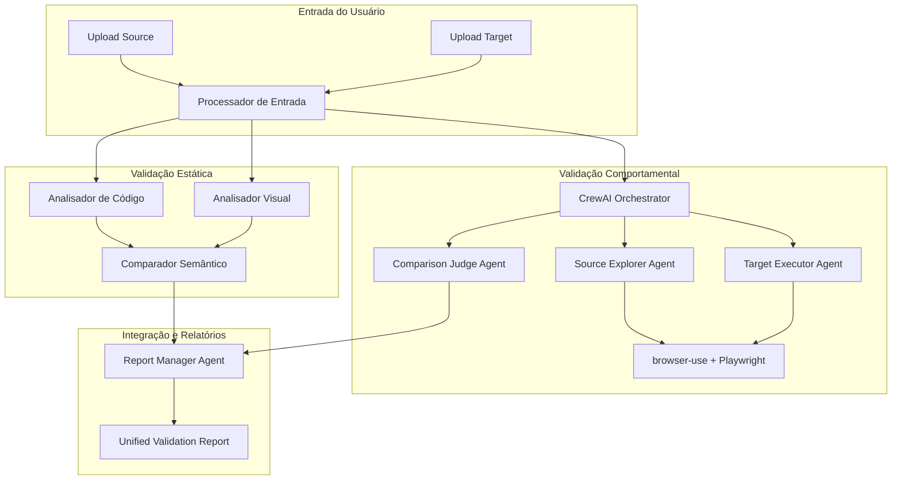

# Sistema de Validação de Migração por IA
**AI-Powered Migration Validation System**

Sistema inteligente de validação que atua como um "QA (Quality Assurance) Automatizado" para processos de migração entre tecnologias, oferecendo validação **estática** e **comportamental** através de múltiplas abordagens de IA.

---

## 🎯 Visão Geral

O **Sistema de Validação de Migração por IA** é uma solução diferenciada que se concentra exclusivamente na **validação pós-migração**, complementando ferramentas de migração existentes. Em vez de competir no mercado saturado de "migração automática", criamos uma nova categoria focada na **garantia de qualidade e fidelidade** das migrações realizadas.

### Problema Resolvido

Ferramentas de migração automática (incluindo outras IAs) podem cometer erros sutis em:
- Lógica de negócios
- Validações de dados
- Elementos de interface
- Fluxos de usuário
- Integrações entre sistemas

Nossa solução oferece a **camada de confiança** que falta no mercado atual.

---

## 🏗️ Arquitetura Integrada: Validação Estática + Comportamental

A arquitetura combina duas abordagens complementares de validação:

### 🔍 **Validação Estática** (Implementação Atual)
Análise de código e recursos estáticos para validação estrutural

### 🎭 **Validação Comportamental** (Nova Capacidade)
Interação automatizada com sistemas em execução para validação funcional



---

## 🛠️ Componentes da Arquitetura

### 1. **Pipeline de Validação Estática** (Existente)

**Etapa 1: Análise e Extração de Features**
- **Analisador de Código**: Extrai estruturas, funções, validações
- **Analisador Visual**: Processa screenshots e elementos visuais
- **Resultado**: Representação abstrata estruturada (JSON)

**Etapa 2: Comparação Semântica**
- **LLM Comparador**: Identifica discrepâncias entre origem e destino
- **Mapeamento Inteligente**: Detecta campos renomeados e lógicas divergentes
- **Resultado**: Lista classificada de discrepâncias

**Etapa 3: Geração de Relatório**
- **Análise de Impacto**: Calcula score de fidelidade
- **Relatório Acionável**: Feedback específico para correções

### 2. **Pipeline de Validação Comportamental** (Novo)

**Arquitetura Multi-Agente com CrewAI**

#### **Agente 1: Source Explorer (Explorador de Origem)**
- **Ferramentas**: browser-use + Playwright
- **Objetivo**: Mapear comportamento do sistema original
- **Tarefas**:
  - Identificar fluxos de usuário
  - Executar cenários de teste (caminho feliz + casos de erro)
  - Documentar validações e mensagens de erro
- **Entregável**: "Diário de Bordo" estruturado com ações e resultados

#### **Agente 2: Target Executor (Executor de Destino)**
- **Ferramentas**: browser-use + Playwright
- **Objetivo**: Replicar ações no sistema migrado
- **Tarefas**:
  - Seguir roteiro do Source Explorer
  - Executar mesmas ações no sistema de destino
  - Documentar resultados e comportamentos observados
- **Entregável**: Segundo "Diário de Bordo" para comparação

#### **Agente 3: Comparison Judge (Juiz Comparador)**
- **Ferramentas**: LLM (Gemini/GPT-4) para análise
- **Objetivo**: Comparar comportamentos e identificar divergências
- **Tarefas**:
  - Analisar os dois diários de bordo
  - Identificar diferenças funcionais
  - Classificar discrepâncias por severidade
- **Entregável**: Lista detalhada de divergências comportamentais

#### **Agente 4: Report Manager (Gerente de Relatórios)**
- **Ferramentas**: LLM para orquestração e síntese
- **Objetivo**: Coordenar equipe e gerar relatório unificado
- **Tarefas**:
  - Orquestrar fluxo entre agentes
  - Integrar resultados de validação estática e comportamental
  - Gerar relatório final unificado
- **Entregável**: Relatório consolidado com ambas as validações

---

## 📊 Modos de Validação

### 🔍 **Modo Estático** (Rápido e Estrutural)
**Quando usar**:
- Validação antes do deployment
- Análise de estrutura de código
- Verificação de contratos de API
- Comparação de modelos de dados

**Vantagens**:
- ⚡ Execução rápida (segundos/minutos)
- 📁 Não requer sistemas rodando
- 🔧 Ideal para desenvolvimento iterativo
- 💰 Custo computacional baixo

### 🎭 **Modo Comportamental** (Profundo e Funcional)
**Quando usar**:
- Validação pré-produção
- Testes de fluxos de usuário
- Verificação de lógicas de negócio complexas
- Validação de integrações entre sistemas

**Vantagens**:
- 🎯 Testa comportamento real
- 🔄 Valida fluxos end-to-end
- 🐛 Detecta bugs de integração
- 👥 Simula experiência do usuário

### 🔄 **Modo Híbrido** (Completo e Confiável)
**Quando usar**:
- Migrações críticas de produção
- Sistemas com alta complexidade
- Validação de compliance e regulamentações
- Projetos com zero tolerância a erros

**Processo**:
1. Validação estática identifica problemas estruturais
2. Correções são aplicadas
3. Validação comportamental confirma funcionamento
4. Relatório unificado com ambas as perspectivas

---

## 💡 Interface do Usuário

### **Configuração da Validação**

```json
{
  "validation_mode": "hybrid", // static, behavioral, hybrid
  "source": {
    "technology": "python-flask",
    "version": "2.0",
    "files": ["app.py", "models.py"],
    "screenshots": ["login.png", "dashboard.png"],
    "urls": ["http://legacy-system.com"] // Para modo comportamental
  },
  "target": {
    "technology": "java-spring",
    "version": "3.0",
    "files": ["Application.java", "UserModel.java"],
    "screenshots": ["new-login.png", "new-dashboard.png"],
    "urls": ["http://new-system.com"] // Para modo comportamental
  },
  "validation_scope": "full_system",
  "behavioral_scenarios": [
    "user_registration_flow",
    "login_validation",
    "data_crud_operations",
    "error_handling"
  ]
}
```

### **Exemplo de Prompt para Validação Comportamental**

> "Valide o fluxo completo de cadastro de produtos. Teste o caminho feliz com dados válidos. Em seguida, verifique as validações de erro para campos obrigatórios e para o campo de preço, que não pode ser negativo. Ao final, confirme se o produto salvo aparece corretamente na tela de listagem."

---

## 🎯 Tecnologias Suportadas

### **Plataformas de Origem/Destino**
- **Backend**: Python (Flask/Django), Java (Spring), C# (.NET), PHP (Laravel), Node.js (Express)
- **Frontend**: JavaScript (React/Vue/Angular), TypeScript, HTML/CSS
- **Mobile**: React Native, Flutter (via screenshots)
- **Databases**: Validação de esquemas e migrações

### **Tipos de Validação**
- **UI e Layout**: Comparação visual e estrutural
- **Funcionalidade Backend**: Lógica de negócios e APIs
- **Estrutura de Dados**: Modelos, tipos, constraints
- **Fluxos de Usuário**: Navegação e interações
- **Integrações**: APIs, bancos de dados, serviços externos

---

## 📈 Resultado da Validação

### **Relatório Unificado**

```json
{
  "overall_status": "approved_with_warnings",
  "fidelity_score": 0.94,
  "validation_modes": {
    "static": {
      "status": "approved",
      "fidelity_score": 0.96,
      "discrepancies": [
        {
          "type": "naming_convention",
          "severity": "warning",
          "description": "Campo 'nome_produto' migrado como 'productName'",
          "recommendation": "Consistência de nomenclatura pode ser mantida"
        }
      ]
    },
    "behavioral": {
      "status": "approved_with_warnings",
      "fidelity_score": 0.92,
      "discrepancies": [
        {
          "type": "validation_behavior",
          "severity": "warning",
          "description": "Mensagem de erro para preço inválido é diferente",
          "source_behavior": "Exibe: 'Preço deve ser positivo'",
          "target_behavior": "Exibe: 'Price must be greater than 0'",
          "recommendation": "Considere manter consistência nas mensagens"
        }
      ]
    }
  },
  "summary": "Migração validada com sucesso. Estrutura e funcionalidade preservadas. Pequenas diferenças em mensagens de interface não comprometem a funcionalidade.",
  "execution_time": {
    "static_validation": 12.5,
    "behavioral_validation": 45.8,
    "total": 58.3
  }
}
```

---

## 🚀 Vantagens Competitivas

### **Diferenciação no Mercado**
1. **Foco Exclusivo em Validação**: Não competimos com ferramentas de migração, complementamos
2. **Dupla Abordagem**: Única solução que combina validação estática + comportamental
3. **Multi-Agente Inteligente**: CrewAI + browser-use para automação avançada
4. **Tecnologia Agnóstica**: Suporta qualquer combinação de tecnologias
5. **Open Source Core**: browser-use oferece flexibilidade e transparência

### **Benefícios para Usuários**
- **Redução de Riscos**: Detecta problemas antes da produção
- **Economia de Tempo**: Automação substitui testes manuais
- **Qualidade Garantida**: Score de fidelidade quantifica a migração
- **Feedback Acionável**: Relatórios específicos para correções
- **Escalabilidade**: Mesma solução para diferentes tecnologias

---

## 🔧 Implementação Técnica

### **Stack Tecnológico**
- **Backend**: Python FastAPI
- **AI/ML**: CrewAI para orquestração, LLMs (Gemini/GPT-4)
- **Browser Automation**: browser-use + Playwright
- **Static Analysis**: AST parsing, computer vision para screenshots
- **Storage**: File system + Redis/Database para sessões
- **API**: RESTful com suporte a upload de arquivos

### **Pipeline de Execução**

```python
class UnifiedMigrationValidator:
    def __init__(self):
        self.static_validator = MigrationValidator()  # Existente
        self.behavioral_crew = CrewAI()  # Novo
        self.report_integrator = ReportIntegrator()  # Novo

    async def validate_migration(self, request):
        results = {}

        # Validação Estática (paralela com Comportamental)
        if request.validation_mode in ["static", "hybrid"]:
            results["static"] = await self.static_validator.validate(request)

        # Validação Comportamental
        if request.validation_mode in ["behavioral", "hybrid"]:
            results["behavioral"] = await self.behavioral_crew.execute(request)

        # Integração dos Resultados
        return self.report_integrator.merge_results(results, request)
```

---

## 📋 Roadmap de Desenvolvimento

### **Fase 1: Integração Base** (4-6 semanas)
- [x] Pipeline de validação estática (Implementado)
- [ ] Integração CrewAI + browser-use
- [ ] Agentes básicos para validação comportamental
- [ ] API unificada para ambos os modos

### **Fase 2: Aprimoramento Multi-Agente** (6-8 semanas)
- [ ] Refinamento dos 4 agentes especializados
- [ ] Otimização de prompts para comparação
- [ ] Melhoria na orquestração de tarefas
- [ ] Dashboard de monitoramento

### **Fase 3: Escala e Performance** (4-6 semanas)
- [ ] Paralelização de validações
- [ ] Cache inteligente de resultados
- [ ] Otimização de custos de LLM
- [ ] Métricas e observabilidade

### **Fase 4: Funcionalidades Avançadas** (8-10 semanas)
- [ ] Machine Learning para detecção de padrões
- [ ] Suporte a mais tecnologias
- [ ] Integração com CI/CD
- [ ] Relatórios visuais interativos

---

## 💼 Casos de Uso

### **1. Migração de Sistema Legacy**
**Cenário**: Banco migra sistema COBOL para Java Spring
**Validação**: Híbrida - estrutura de dados + fluxos transacionais
**Valor**: Zero downtime, compliance garantido

### **2. Modernização de Frontend**
**Cenário**: E-commerce migra jQuery para React
**Validação**: Comportamental - jornadas de compra + checkout
**Valor**: UX preservada, conversão mantida

### **3. Refatoração de Microserviços**
**Cenário**: Monolito dividido em microserviços
**Validação**: Estática para APIs + Comportamental para integrações
**Valor**: Arquitetura validada, performance garantida

---

## 🎯 Conclusão

O **Sistema de Validação de Migração por IA** representa uma **nova categoria** de produto no mercado de desenvolvimento de software. Ao combinar validação estática e comportamental através de agentes de IA especializados, oferecemos uma solução única que:

- **Reduz Riscos** de migrações críticas
- **Aumenta Confiança** em processos automatizados
- **Acelera Delivery** com validação automatizada
- **Garante Qualidade** através de múltiplas perspectivas

A arquitetura híbrida permite atender desde validações rápidas de desenvolvimento até validações críticas de produção, posicionando a solução como **essencial** para qualquer processo de migração ou modernização de sistemas.

**Diferencial Único**: Somos a única solução que oferece validação **estática + comportamental** integrada, criando um novo padrão de qualidade para migrações de software.