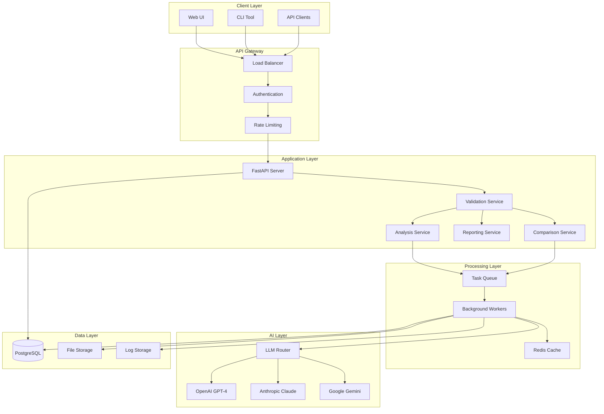

# AI-Powered Migration Validation System - Technical Specifications

**Version**: 1.0.0
**Date**: 2025-09-19
**Status**: Active Development

## Overview

This document provides detailed technical specifications for implementing the AI-Powered Migration Validation System. It covers system architecture, API specifications, data models, security requirements, and integration guidelines.

## System Architecture

### **High-Level Architecture**



### **Component Specifications**

#### **1. FastAPI Application Server**
```python
# Configuration
FASTAPI_CONFIG = {
    "title": "AI-Powered Migration Validation System",
    "version": "1.0.0",
    "docs_url": "/docs",
    "redoc_url": "/redoc",
    "openapi_url": "/openapi.json"
}

# Performance Settings
UVICORN_CONFIG = {
    "host": "0.0.0.0",
    "port": 8000,
    "workers": 4,
    "worker_class": "uvicorn.workers.UvicornWorker",
    "keepalive": 2,
    "max_requests": 1000,
    "max_requests_jitter": 50
}
```

#### **2. Database Schema (PostgreSQL)**
```sql
-- Users and Authentication
CREATE TABLE users (
    id UUID PRIMARY KEY DEFAULT gen_random_uuid(),
    email VARCHAR(255) UNIQUE NOT NULL,
    password_hash VARCHAR(255) NOT NULL,
    role VARCHAR(50) NOT NULL DEFAULT 'user',
    created_at TIMESTAMP DEFAULT NOW(),
    updated_at TIMESTAMP DEFAULT NOW(),
    last_login TIMESTAMP,
    is_active BOOLEAN DEFAULT TRUE
);

-- Validation Sessions
CREATE TABLE validation_sessions (
    id UUID PRIMARY KEY DEFAULT gen_random_uuid(),
    request_id VARCHAR(255) UNIQUE NOT NULL,
    user_id UUID REFERENCES users(id),
    status VARCHAR(50) NOT NULL DEFAULT 'pending',
    source_technology VARCHAR(100) NOT NULL,
    target_technology VARCHAR(100) NOT NULL,
    validation_scope VARCHAR(100) NOT NULL,
    created_at TIMESTAMP DEFAULT NOW(),
    started_at TIMESTAMP,
    completed_at TIMESTAMP,
    fidelity_score FLOAT,
    overall_status VARCHAR(50),
    summary TEXT,
    execution_time FLOAT,
    metadata JSONB DEFAULT '{}'
);

-- Validation Discrepancies
CREATE TABLE validation_discrepancies (
    id UUID PRIMARY KEY DEFAULT gen_random_uuid(),
    session_id UUID REFERENCES validation_sessions(id) ON DELETE CASCADE,
    type VARCHAR(100) NOT NULL,
    severity VARCHAR(20) NOT NULL,
    description TEXT NOT NULL,
    source_element TEXT,
    target_element TEXT,
    recommendation TEXT,
    confidence FLOAT DEFAULT 1.0,
    created_at TIMESTAMP DEFAULT NOW()
);

-- File Uploads
CREATE TABLE uploaded_files (
    id UUID PRIMARY KEY DEFAULT gen_random_uuid(),
    session_id UUID REFERENCES validation_sessions(id) ON DELETE CASCADE,
    filename VARCHAR(255) NOT NULL,
    file_path VARCHAR(500) NOT NULL,
    file_size INTEGER NOT NULL,
    file_type VARCHAR(100) NOT NULL,
    uploaded_at TIMESTAMP DEFAULT NOW(),
    is_source BOOLEAN NOT NULL
);

-- Processing Logs
CREATE TABLE processing_logs (
    id UUID PRIMARY KEY DEFAULT gen_random_uuid(),
    session_id UUID REFERENCES validation_sessions(id) ON DELETE CASCADE,
    level VARCHAR(20) NOT NULL,
    message TEXT NOT NULL,
    timestamp TIMESTAMP DEFAULT NOW(),
    metadata JSONB DEFAULT '{}'
);

-- API Keys (for programmatic access)
CREATE TABLE api_keys (
    id UUID PRIMARY KEY DEFAULT gen_random_uuid(),
    user_id UUID REFERENCES users(id) ON DELETE CASCADE,
    key_hash VARCHAR(255) NOT NULL,
    name VARCHAR(100) NOT NULL,
    permissions JSONB DEFAULT '[]',
    last_used TIMESTAMP,
    created_at TIMESTAMP DEFAULT NOW(),
    expires_at TIMESTAMP,
    is_active BOOLEAN DEFAULT TRUE
);

-- Indexes for performance
CREATE INDEX idx_validation_sessions_user_id ON validation_sessions(user_id);
CREATE INDEX idx_validation_sessions_status ON validation_sessions(status);
CREATE INDEX idx_validation_sessions_created_at ON validation_sessions(created_at);
CREATE INDEX idx_discrepancies_session_id ON validation_discrepancies(session_id);
CREATE INDEX idx_discrepancies_severity ON validation_discrepancies(severity);
CREATE INDEX idx_uploaded_files_session_id ON uploaded_files(session_id);
CREATE INDEX idx_processing_logs_session_id ON processing_logs(session_id);
CREATE INDEX idx_api_keys_user_id ON api_keys(user_id);
```

## API Specifications

### **REST API Endpoints**

#### **Authentication Endpoints**
```yaml
POST /api/auth/login:
  description: User authentication
  request_body:
    email: string
    password: string
  responses:
    200:
      access_token: string (JWT)
      refresh_token: string
      user_info: object
    401:
      error: "Invalid credentials"

POST /api/auth/refresh:
  description: Refresh access token
  request_body:
    refresh_token: string
  responses:
    200:
      access_token: string
    401:
      error: "Invalid refresh token"

POST /api/auth/logout:
  description: Logout user
  headers:
    Authorization: "Bearer {access_token}"
  responses:
    200:
      message: "Logged out successfully"
```

#### **Validation Endpoints**
```yaml
POST /api/validate:
  description: Start migration validation
  content_type: multipart/form-data
  headers:
    Authorization: "Bearer {access_token}"
  form_data:
    request_data: string (JSON)
    source_files: array[file]
    source_screenshots: array[file]
    target_files: array[file]
    target_screenshots: array[file]
  responses:
    202:
      request_id: string
      status: "accepted"
      message: string
    400:
      error: "Validation error"
      details: array[string]

GET /api/validate/{request_id}/status:
  description: Get validation status
  headers:
    Authorization: "Bearer {access_token}"
  responses:
    200:
      request_id: string
      status: string (pending|processing|completed|error)
      progress: string
      result_available: boolean
    404:
      error: "Request not found"

GET /api/validate/{request_id}/result:
  description: Get validation results
  headers:
    Authorization: "Bearer {access_token}"
  responses:
    200:
      request_id: string
      overall_status: string
      fidelity_score: float
      summary: string
      discrepancy_counts: object
      execution_time: float
    202:
      message: "Still processing"
    404:
      error: "Request not found"

GET /api/validate/{request_id}/report:
  description: Get detailed report
  query_parameters:
    format: string (json|html|markdown|pdf)
  headers:
    Authorization: "Bearer {access_token}"
  responses:
    200:
      content: string|binary (based on format)
    404:
      error: "Request not found"
```

#### **File Management Endpoints**
```yaml
POST /api/upload/source:
  description: Upload source files
  content_type: multipart/form-data
  headers:
    Authorization: "Bearer {access_token}"
  form_data:
    files: array[file]
  responses:
    200:
      message: string
      files: array[object]
    400:
      error: "Upload validation error"

POST /api/upload/target:
  description: Upload target files
  content_type: multipart/form-data
  headers:
    Authorization: "Bearer {access_token}"
  form_data:
    files: array[file]
  responses:
    200:
      message: string
      files: array[object]
    400:
      error: "Upload validation error"
```

#### **Configuration Endpoints**
```yaml
GET /api/technologies:
  description: Get supported technologies
  responses:
    200:
      source_technologies: array[object]
      target_technologies: array[object]
      validation_scopes: array[object]

GET /api/capabilities:
  description: Get system capabilities
  responses:
    200:
      technologies: array[string]
      validation_scopes: array[string]
      input_types: array[string]
      capabilities: object

POST /api/compatibility/check:
  description: Check technology compatibility
  request_body:
    source_technology: string
    target_technology: string
    validation_scope: string
  responses:
    200:
      compatible: boolean
      issues: array[string]
      warnings: array[string]
```

### **WebSocket API (Real-time Updates)**
```yaml
WS /ws/validate/{request_id}:
  description: Real-time validation progress
  authentication: JWT token in query parameter
  messages:
    progress_update:
      type: "progress"
      stage: string
      percentage: float
      message: string
    completion:
      type: "complete"
      result: object
    error:
      type: "error"
      message: string
```

## LLM Integration Specifications

### **LLM Provider Interface**
```python
from abc import ABC, abstractmethod
from typing import Dict, Any, List, Optional
from dataclasses import dataclass

@dataclass
class LLMRequest:
    prompt: str
    model: str
    max_tokens: int = 4000
    temperature: float = 0.1
    system_prompt: Optional[str] = None
    context: Optional[Dict[str, Any]] = None

@dataclass
class LLMResponse:
    content: str
    model: str
    tokens_used: int
    cost: float
    latency: float
    provider: str

class LLMProvider(ABC):
    @abstractmethod
    async def generate(self, request: LLMRequest) -> LLMResponse:
        pass

    @abstractmethod
    async def health_check(self) -> bool:
        pass

    @abstractmethod
    def get_cost_per_token(self, model: str) -> Dict[str, float]:
        pass

class LLMService:
    def __init__(self):
        self.providers: Dict[str, LLMProvider] = {}
        self.failover_order = ["openai", "anthropic", "google"]
        self.circuit_breaker = CircuitBreaker()

    async def generate(self, request: LLMRequest) -> LLMResponse:
        for provider_name in self.failover_order:
            try:
                provider = self.providers[provider_name]
                return await provider.generate(request)
            except Exception as e:
                logger.warning(f"Provider {provider_name} failed: {e}")
                continue
        raise LLMServiceError("All providers failed")
```

### **Prompt Templates**
```python
# Code Analysis Prompt
CODE_ANALYSIS_PROMPT = """
You are an expert software engineer analyzing code for migration validation.

Analyze the following {language} code and extract:
1. Functions/methods with their parameters and business logic summary
2. Data structures and their fields with types
3. API endpoints and their HTTP methods
4. UI elements if present (forms, buttons, inputs)

Code to analyze:
```{language}
{code_content}
```

Return your analysis in the following JSON format:
{
  "functions": [
    {
      "name": "function_name",
      "parameters": ["param1", "param2"],
      "return_type": "type",
      "business_logic": "brief description of what this function does",
      "complexity": "low|medium|high"
    }
  ],
  "data_structures": [
    {
      "name": "structure_name",
      "type": "class|interface|model",
      "fields": [
        {
          "name": "field_name",
          "type": "field_type",
          "required": true|false,
          "constraints": ["constraint1", "constraint2"]
        }
      ]
    }
  ],
  "api_endpoints": [
    {
      "path": "/api/path",
      "methods": ["GET", "POST"],
      "function": "handler_function_name"
    }
  ],
  "ui_elements": [
    {
      "type": "input|button|form|etc",
      "id": "element_id",
      "attributes": {"key": "value"}
    }
  ]
}
"""

# Semantic Comparison Prompt
SEMANTIC_COMPARISON_PROMPT = """
You are an expert in software migration validation. Compare these two system representations and identify all meaningful differences.

Source System ({source_tech}):
{source_representation}

Target System ({target_tech}):
{target_representation}

Focus Areas: {validation_scope}

Identify discrepancies in these categories:
1. Missing elements (in source but not target)
2. Additional elements (in target but not source)
3. Modified elements (different behavior/structure)
4. Renamed elements (same function, different name)

For each discrepancy, provide:
- Type: missing_element|additional_element|modified_element|renamed_element
- Severity: critical|warning|info
- Description: Clear explanation of the difference
- Confidence: 0.0-1.0 (how certain you are)
- Recommendation: What action should be taken

Return analysis in JSON format:
{
  "discrepancies": [
    {
      "type": "discrepancy_type",
      "severity": "critical|warning|info",
      "description": "clear description",
      "source_element": "element description",
      "target_element": "element description",
      "confidence": 0.95,
      "recommendation": "suggested action"
    }
  ],
  "overall_assessment": {
    "fidelity_score": 0.85,
    "migration_quality": "excellent|good|acceptable|poor",
    "summary": "brief assessment of migration quality"
  }
}
"""
```

## Security Specifications

### **Authentication & Authorization**
```python
# JWT Configuration
JWT_CONFIG = {
    "algorithm": "RS256",
    "access_token_expire_minutes": 60,
    "refresh_token_expire_days": 30,
    "issuer": "migration-validation-system",
    "audience": "migration-validation-api"
}

# Role-Based Access Control
RBAC_PERMISSIONS = {
    "admin": [
        "users:*",
        "validations:*",
        "system:*"
    ],
    "validator": [
        "validations:create",
        "validations:read:own",
        "validations:update:own",
        "files:upload",
        "reports:generate"
    ],
    "viewer": [
        "validations:read:shared",
        "reports:view"
    ]
}

# API Key Scopes
API_KEY_SCOPES = [
    "validations:create",
    "validations:read",
    "reports:generate",
    "system:status"
]
```

### **Input Validation**
```python
# File Upload Restrictions
FILE_UPLOAD_CONFIG = {
    "max_file_size": 10 * 1024 * 1024,  # 10MB
    "max_total_size": 100 * 1024 * 1024,  # 100MB
    "max_files_per_request": 50,
    "allowed_extensions": {
        "code": [".py", ".js", ".jsx", ".ts", ".tsx", ".java", ".cs", ".php", ".html", ".css"],
        "images": [".png", ".jpg", ".jpeg", ".gif", ".bmp", ".webp"]
    },
    "scan_for_malware": True,
    "validate_mime_types": True
}

# Request Rate Limiting
RATE_LIMITING = {
    "global": "1000/hour",
    "per_user": "100/hour",
    "per_ip": "200/hour",
    "validation_requests": "10/hour/user",
    "file_uploads": "50/hour/user"
}
```

### **Security Headers**
```python
SECURITY_HEADERS = {
    "X-Content-Type-Options": "nosniff",
    "X-Frame-Options": "DENY",
    "X-XSS-Protection": "1; mode=block",
    "Strict-Transport-Security": "max-age=31536000; includeSubDomains",
    "Content-Security-Policy": "default-src 'self'",
    "Referrer-Policy": "strict-origin-when-cross-origin"
}
```

## Performance Specifications

### **Response Time Requirements**
- **API Health Check**: < 50ms
- **Authentication**: < 200ms
- **File Upload**: < 2s (per 10MB)
- **Validation Status**: < 100ms
- **Report Generation**: < 5s
- **Complete Validation**: < 5 minutes (typical project)

### **Throughput Requirements**
- **Concurrent Users**: 100
- **Validations per Hour**: 500
- **File Uploads per Hour**: 1000
- **API Requests per Second**: 100

### **Resource Requirements**

#### **Production Environment**
```yaml
Application Server:
  CPU: 4 cores
  Memory: 8GB
  Storage: 100GB SSD
  Network: 1Gbps

Database (PostgreSQL):
  CPU: 2 cores
  Memory: 4GB
  Storage: 200GB SSD
  Connections: 100

Cache (Redis):
  Memory: 4GB
  Persistence: AOF
  Cluster: 3 nodes

Load Balancer:
  CPU: 2 cores
  Memory: 2GB
  SSL Termination: Yes
```

### **Caching Strategy**
```python
CACHE_CONFIG = {
    "redis_url": "redis://localhost:6379",
    "default_ttl": 3600,  # 1 hour
    "cache_keys": {
        "file_analysis": "analysis:{file_hash}",
        "llm_responses": "llm:{prompt_hash}",
        "user_sessions": "session:{session_id}",
        "validation_results": "result:{request_id}"
    },
    "cache_policies": {
        "file_analysis": "7d",  # Cache for 7 days
        "llm_responses": "30d", # Cache for 30 days
        "validation_results": "7d"
    }
}
```

## Error Handling & Logging

### **Error Response Format**
```json
{
  "error": {
    "code": "VALIDATION_ERROR",
    "message": "Human-readable error message",
    "details": {
      "field": "Specific field that caused error",
      "reason": "Detailed reason for error"
    },
    "request_id": "req_12345",
    "timestamp": "2025-09-19T10:30:00Z"
  }
}
```

### **Error Codes**
```python
ERROR_CODES = {
    # Authentication Errors (1000-1999)
    "AUTH_REQUIRED": 1001,
    "INVALID_TOKEN": 1002,
    "TOKEN_EXPIRED": 1003,
    "INSUFFICIENT_PERMISSIONS": 1004,

    # Validation Errors (2000-2999)
    "INVALID_REQUEST": 2001,
    "UNSUPPORTED_TECHNOLOGY": 2002,
    "FILE_TOO_LARGE": 2003,
    "INVALID_FILE_TYPE": 2004,
    "ANALYSIS_FAILED": 2005,

    # System Errors (3000-3999)
    "LLM_SERVICE_UNAVAILABLE": 3001,
    "DATABASE_ERROR": 3002,
    "CACHE_ERROR": 3003,
    "QUEUE_ERROR": 3004,

    # Rate Limiting (4000-4999)
    "RATE_LIMIT_EXCEEDED": 4001,
    "QUOTA_EXCEEDED": 4002
}
```

### **Logging Configuration**
```python
LOGGING_CONFIG = {
    "version": 1,
    "disable_existing_loggers": False,
    "formatters": {
        "json": {
            "format": "%(asctime)s %(name)s %(levelname)s %(message)s",
            "class": "pythonjsonlogger.jsonlogger.JsonFormatter"
        }
    },
    "handlers": {
        "console": {
            "class": "logging.StreamHandler",
            "formatter": "json",
            "level": "INFO"
        },
        "file": {
            "class": "logging.handlers.RotatingFileHandler",
            "filename": "/var/log/migration-validator/app.log",
            "maxBytes": 100000000,  # 100MB
            "backupCount": 5,
            "formatter": "json",
            "level": "DEBUG"
        }
    },
    "loggers": {
        "migration_validator": {
            "handlers": ["console", "file"],
            "level": "DEBUG",
            "propagate": False
        }
    }
}
```

## Monitoring & Observability

### **Metrics Collection**
```python
# Prometheus Metrics
METRICS = {
    "http_requests_total": Counter(
        "http_requests_total",
        "Total HTTP requests",
        ["method", "endpoint", "status"]
    ),
    "validation_duration_seconds": Histogram(
        "validation_duration_seconds",
        "Validation processing time",
        ["technology_pair", "scope"]
    ),
    "llm_requests_total": Counter(
        "llm_requests_total",
        "Total LLM requests",
        ["provider", "model", "status"]
    ),
    "llm_tokens_total": Counter(
        "llm_tokens_total",
        "Total tokens consumed",
        ["provider", "model", "type"]
    ),
    "cache_hits_total": Counter(
        "cache_hits_total",
        "Cache hits",
        ["cache_type", "hit_miss"]
    )
}
```

### **Health Check Endpoints**
```yaml
GET /health:
  description: Basic health check
  responses:
    200:
      status: "healthy"
      timestamp: "2025-09-19T10:30:00Z"

GET /health/detailed:
  description: Detailed health check
  responses:
    200:
      status: "healthy"
      services:
        database: "healthy"
        cache: "healthy"
        llm_service: "healthy"
        queue: "healthy"
      metrics:
        uptime: 86400
        memory_usage: 0.6
        cpu_usage: 0.4

GET /metrics:
  description: Prometheus metrics endpoint
  responses:
    200: prometheus_metrics_format
```

## Deployment Specifications

### **Docker Configuration**
```dockerfile
# Multi-stage Dockerfile
FROM python:3.11-slim as builder
WORKDIR /app
COPY requirements.txt .
RUN pip install --no-cache-dir -r requirements.txt

FROM python:3.11-slim as runtime
WORKDIR /app
COPY --from=builder /usr/local/lib/python3.11/site-packages /usr/local/lib/python3.11/site-packages
COPY src/ ./src/
COPY config/ ./config/

EXPOSE 8000
HEALTHCHECK --interval=30s --timeout=10s --start-period=5s --retries=3 \
  CMD curl -f http://localhost:8000/health || exit 1

CMD ["uvicorn", "src.api.routes:app", "--host", "0.0.0.0", "--port", "8000"]
```

### **Kubernetes Deployment**
```yaml
apiVersion: apps/v1
kind: Deployment
metadata:
  name: migration-validator
spec:
  replicas: 3
  selector:
    matchLabels:
      app: migration-validator
  template:
    metadata:
      labels:
        app: migration-validator
    spec:
      containers:
      - name: migration-validator
        image: migration-validator:latest
        ports:
        - containerPort: 8000
        env:
        - name: DATABASE_URL
          valueFrom:
            secretKeyRef:
              name: migration-validator-secrets
              key: database_url
        - name: REDIS_URL
          valueFrom:
            secretKeyRef:
              name: migration-validator-secrets
              key: redis_url
        resources:
          requests:
            memory: "1Gi"
            cpu: "500m"
          limits:
            memory: "2Gi"
            cpu: "1000m"
        livenessProbe:
          httpGet:
            path: /health
            port: 8000
          initialDelaySeconds: 30
          periodSeconds: 10
        readinessProbe:
          httpGet:
            path: /health/detailed
            port: 8000
          initialDelaySeconds: 5
          periodSeconds: 5
---
apiVersion: v1
kind: Service
metadata:
  name: migration-validator-service
spec:
  selector:
    app: migration-validator
  ports:
  - protocol: TCP
    port: 80
    targetPort: 8000
  type: LoadBalancer
```

## Testing Specifications

### **Test Coverage Requirements**
- **Unit Tests**: > 85% code coverage
- **Integration Tests**: All API endpoints
- **End-to-End Tests**: Complete validation workflows
- **Performance Tests**: Load testing with 100 concurrent users
- **Security Tests**: OWASP Top 10 compliance

### **Test Data Management**
```python
# Test Fixtures
TEST_FIXTURES = {
    "sample_projects": {
        "python_flask_to_java_spring": {
            "source_files": ["app.py", "models.py", "templates/"],
            "target_files": ["Application.java", "Controller.java", "Model.java"],
            "expected_discrepancies": 3,
            "expected_fidelity": 0.85
        },
        "react_to_vue": {
            "source_files": ["App.jsx", "components/"],
            "target_files": ["App.vue", "components/"],
            "expected_discrepancies": 5,
            "expected_fidelity": 0.90
        }
    }
}
```

This technical specification provides the detailed implementation guidelines needed to complete the AI-Powered Migration Validation System. Each section includes specific configurations, code examples, and requirements that development teams can follow to ensure consistent, high-quality implementation.